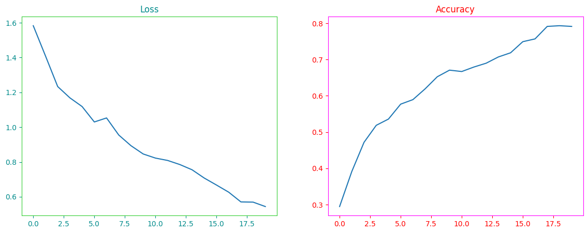
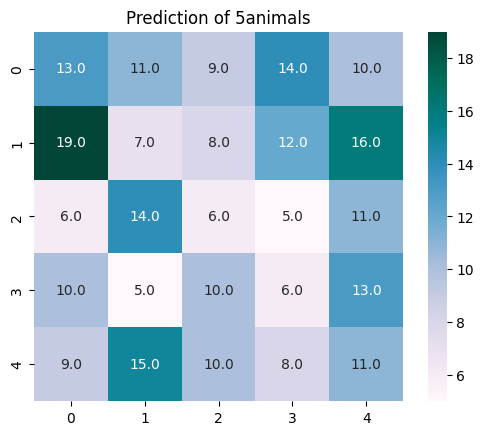
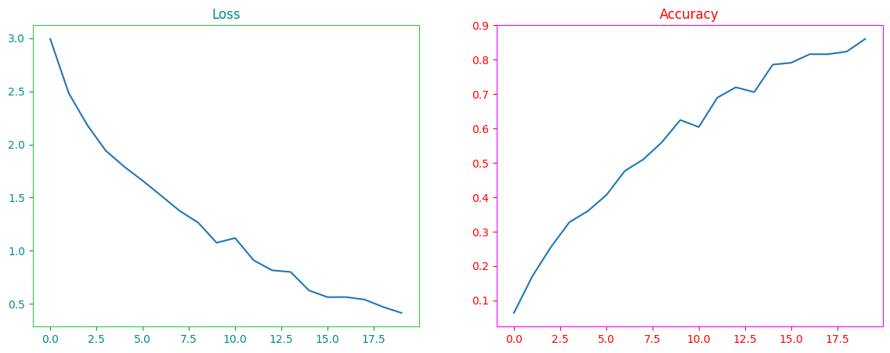
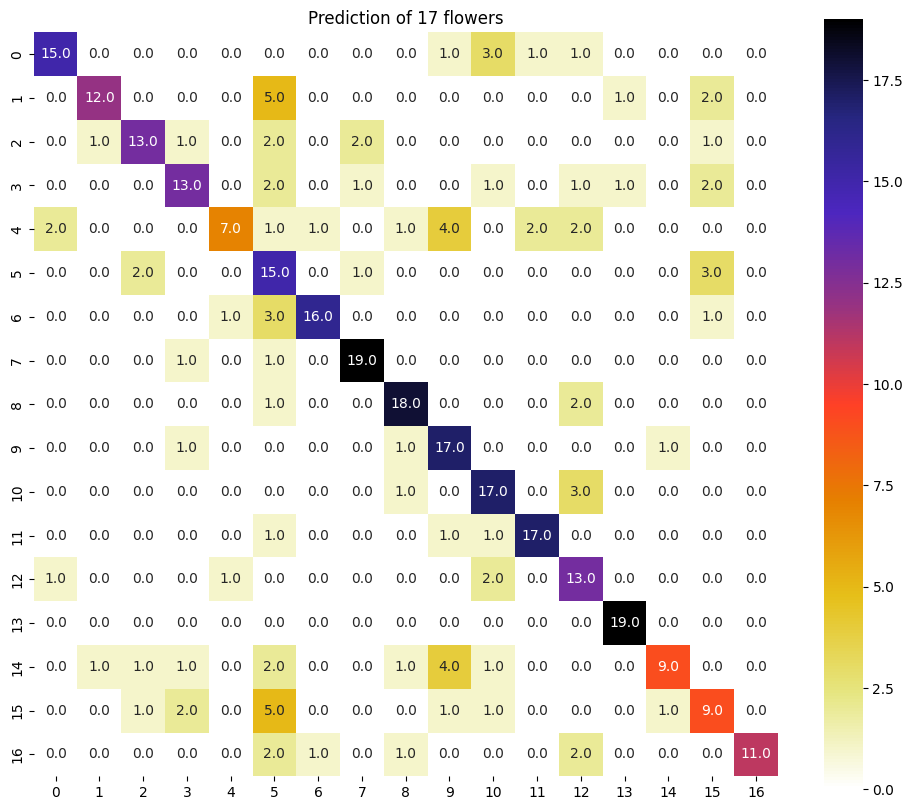
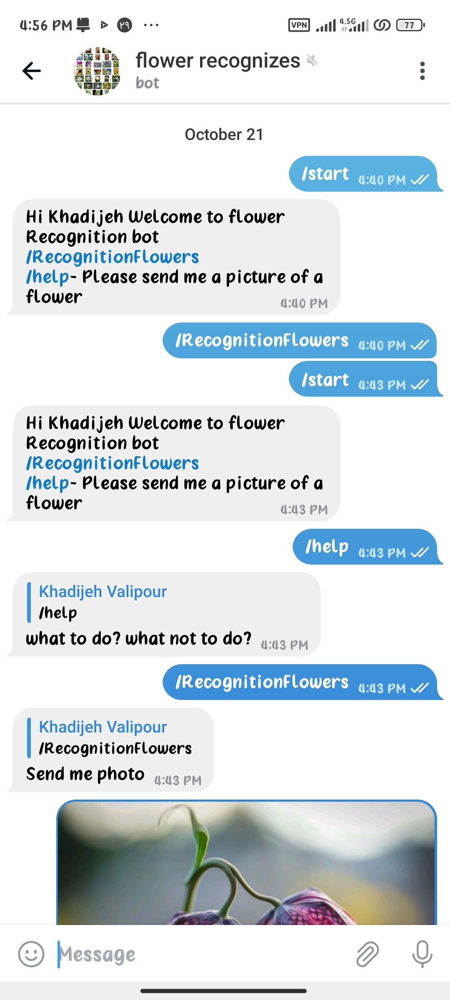
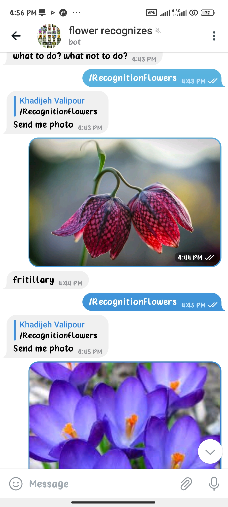
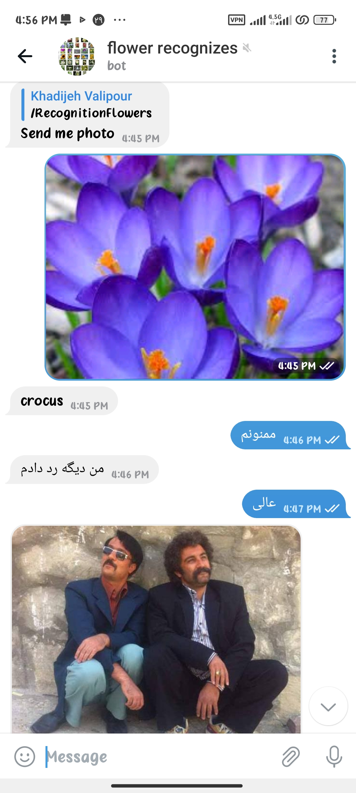

# 5 Animals and 17 Flowers

](17Flowers/assents/image.png)


## How to install


```
pip install requirements.txt
```

##  How to train


1. Lass and accuracy  plot of the project related to 5 animals



| Dataset       | Loss        | Accuracy |
| -------       | ---         | ---      |
| Train         |    0.54   | 79.14%     | 
| Validation    |    0.78   | 70.54%     |

  ###  confusion matrix 



2. Lass and accuracy  plot of the project related to
17 flowers




| Dataset       | Loss      | Accuracy |
| -------       | ---       | ---      |
| Train         |    0.41   | 86.05%   | 
| Validation    |    0.94   | 64.21%   |
| Test          |    1.17   | 70.58%   | 


  ###  confusion matrix 




##  How to run


I have saved the files with the H5 extension in the [weights](https://drive.google.com/drive/folders/12bdbZoNq5lRNb9XbeVFOUfainYlblwzP?usp=drive_link) folder, you can enjoy them by running them quickly.







